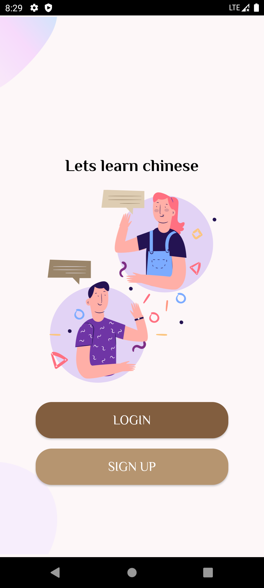
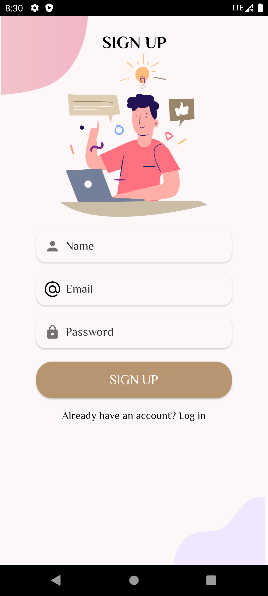
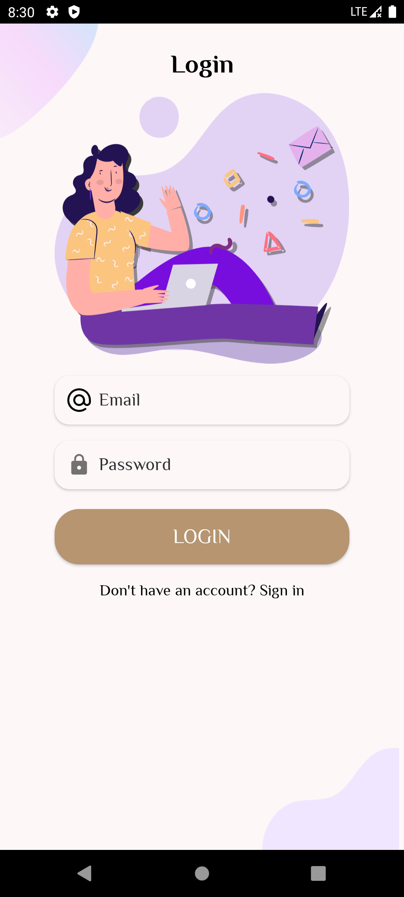

# LearnChinese-Android
## Introduction
Welcome to the Chinese Learning App repository! 📚🇨🇳

Our mobile application is your gateway to mastering Mandarin effectively and efficiently. Built on a comprehensive system design, it integrates various components to provide a seamless learning experience.

**Key Components:**

1. **User Interface:** Experience an intuitive, visually appealing interface that ensures smooth navigation and engagement with the app's features.

2. **Database:** Our scalable and robust database manages user data, progress tracking, profiles, and learning materials to support a seamless learning journey for multiple users.

3. **Content Management System (CMS):** Easily access and update learning materials, including text, audio, and video content, through a user-friendly CMS designed for administrators.

4. **Social Interaction Features:** Engage with fellow learners through discussion forums, chat, language exchange, and virtual meetups, enhancing your language skills through peer interaction and feedback.

5. **AI Interaction Features:** Practice conversation skills confidently with our chatbot, receiving instant feedback to improve sentence structures, vocabulary, and pronunciation without fear of judgment.

Our system design analysis highlights the robust framework supporting the Chinese Learning App's functionality, scalability, and user experience. Join us on your journey to fluency! 🚀
Explore the rich tapestry of Mandarin with our LearnChinese-Android  app. Dive into an immersive learning experience crafted with Java on Android Studio. Master essential vocabulary, grammar, and pronunciation with interactive lessons and quizzes. Start your journey to fluency today!

### App Images






## Installation
### Installation Guide for the Android Application

To get this application up and running, follow the steps outlined below. Ensure you have a basic understanding of software development and database management.

#### Prerequisites

- Android Studio
- JDK (Java Development Kit)
- XAMPP (for MySQL and Apache server)
- Git (optional, for version control)

#### Steps

1. **Install Android Studio**
   - Download Android Studio from the official website and follow the installation instructions. Ensure you install the Android SDK and set up the environment variables correctly.

2. **Set Up XAMPP**
   - Download and install XAMPP from its official website. This will be used to run the MySQL database and PHP for the backend.
   - Launch XAMPP and start the Apache and MySQL modules. Ensure both services are running.

3. **Clone/Download the Project**
   - If the project is hosted on a version control platform like GitHub, use Git to clone the project to your local machine. Alternatively, download the project ZIP and extract it.
   ```bash
   git clone [https://github.com/praise-arowolo/LearnChinese-Android.git]
   ```

4. **Open the Project in Android Studio**
   - Open Android Studio, select "Open an existing Android Studio project," and navigate to your project directory.
   - Wait for Android Studio to index the project and download any necessary Gradle dependencies.

5. **Set Up the Database**
   - Access phpMyAdmin from XAMPP's control panel by clicking on the 'Admin' button next to MySQL.
   - Create a new database and import the provided SQL file (if available) to set up your tables and initial data.

6. **Configure Database Connection**
   - Locate the PHP backend files within your project (if separated) and update the database connection details (host, username, password, and database name) in the configuration file to match your XAMPP MySQL settings.

7. **Run the Backend Server**
   - Ensure the Apache server is running in XAMPP for the backend to be accessible. If your backend is a separate application, follow its specific setup instructions.

8. **Build and Run the Application**
   - In Android Studio, select an emulator or connect a physical Android device.
   - Click on the 'Run' button to build and deploy the application to your chosen device.

9. **Testing**
   - Once installed, open the app and test its functionalities to ensure everything is working as expected. This includes registering, logging in, and accessing the different features provided by the app.

#### Troubleshooting

- If you encounter any build errors, check that Android Studio is updated to the latest version and that all plugins and dependencies are correctly configured.
- For database connection issues, verify that XAMPP's MySQL service is running and that your database credentials are correct in the PHP backend files.

Following these steps should help you successfully set up and run the Android application.

## Contributing

Feel free to contibute to this project , you can also add new features to make it more better , Thanks ...
